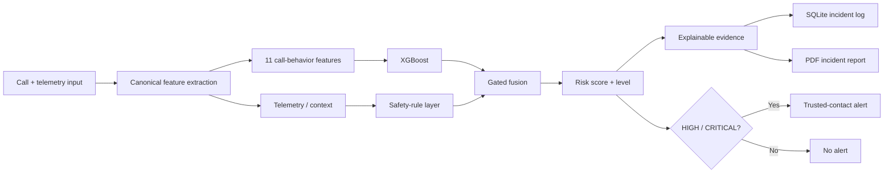

# LUMINA — AI Bridge Against Digital-Arrest Isolation

A research prototype for behavioral-isolation detection and silent trusted-contact intervention against "digital-arrest" scams.

---

## Problem & Insight

Digital-arrest scams impersonate police or government officials. The victim is kept on a long video call, threatened with arrest, and explicitly told not to contact anyone. The decisive feature of the attack is not the content of the deception — it is the **isolation** it imposes:

- prolonged, uncontrolled calls
- unknown callers with no verifiable history
- video calls used for intimidation
- reduced or zero outward communication
- device behavior that locks the user into the interaction

Traditional reporting tools act **after** the victim recognizes the fraud. A victim under active digital arrest is usually unable to seek help at all. Lumina targets an earlier intervention point: recognizing the behavioral pattern while the person is still inside the trap, and reaching a trusted contact on their behalf.

---

## System Architecture & Data Flow

```text
INCOMING EVENT (call + telemetry)
                │
                ▼
   CANONICAL FEATURE SCHEMA (29 fields)
                │
     ┌──────────┴──────────┐
     ▼                     ▼
  ML LAYER            SAFETY-RULE LAYER
  (11 call-           (call + telemetry
  behavior            context, missingness
  features)           indicators)
     └──────────┬──────────┘
                ▼
          GATED FUSION
                │
                ▼
     RISK SCORE + LEVEL
                │
                ▼
    SILENT INTERVENTION
```

The central architectural boundary is explicit: **device telemetry never enters the ML model directly.** Telemetry fields are consumed only by the safety-rule layer, so missing telemetry can never be silently coerced into model input.

Data flow:

- A call + telemetry scenario enters the API.
- Canonical features are generated and separated into ML features and telemetry/context.
- XGBoost and the safety-rule layer evaluate the evidence independently.
- Gated fusion produces the risk score, level, and explainable evidence.
- HIGH/CRITICAL risk can trigger the trusted-contact intervention path; demo delivery is simulated by default.

---

## How Lumina Works

Lumina works by fusing two independent layers:

1. an **XGBoost classifier** over 11 call-behavior features, and
2. a **deterministic safety-rule layer** over call + telemetry context,

then applying conservative **escalation gates** so the ML model can corroborate evidence but never manufacture a HIGH or CRITICAL risk on its own.



### ML layer

The deployed classifier is an **XGBoost** `XGBClassifier` (binary, `binary:logistic`) operating on the 11 call-behavior features, wrapped with a **Platt (sigmoid) calibration layer** (`CalibratedClassifierCV`). Training is fully scripted in `notebooks/train_simple_model.py`:

- **Data**: 15,000 synthetic call snapshots (scam rate ~15%), generated from class-conditional distributions with realistic overlap between scam and normal calls.
- **Model**: `n_estimators=150`, `max_depth=4`, `learning_rate=0.08`, `subsample=0.8`, `colsample_bytree=0.8`, `min_child_weight=3`, `reg_alpha=0.1`, `reg_lambda=1.0`, `random_state=42`.
- **Preprocessing**: `StandardScaler` fitted on the training split.
- **Split**: 80/20 stratified train/test with a fixed random seed (`random_state=42`). Calibration is fitted via 5-fold cross-validation on the training split.
- **Artifacts**: tracked at `models/saved/risk_classifier.pkl`, `scaler.pkl`, `features.pkl`, `calibrator.pkl`.
- **Feature contract**: all feature transformations (binning, log transforms, time-of-day flags) are defined in `app/core/transforms.py` — a single canonical module shared by training, inference, and evaluation. There is no train/serve skew.

Feature importance on the synthetic development data is dominated by `outgoing_activity_ratio` (~32%) and `is_video_call` (~13%) — consistent with the isolation thesis: reduced outward communication is the strongest signal the model learns.

- The risk engine exposes both `raw_ml_probability` and `calibrated_ml_probability`. When the calibration layer is available, the calibrated probability is used for fusion; otherwise the raw probability is used as a safe fallback.
- Telemetry is excluded from the ML vector by construction (`MODEL_EXCLUDED_FEATURES` in `app/core/features.py`).
- On load, `RiskEngine` validates that the model's `n_features_in_` equals the scaler's feature count and the `features.pkl` list, that the feature ordering matches the scaler's training order, and that no telemetry field appears in the model schema. Invalid states set `model_status` to `degraded` and ML is not served.
- If the ML artifacts are unavailable or the prediction fails at runtime, scoring falls back to the rule score alone and `ml_probability` is returned as `null` — a fabricated probability (e.g. `0.5`) is never substituted.

### Safety-rule layer

`RiskEngine._safety_rules()` evaluates explicit, explainable signals with fixed weights, including:

- very long calls (>= 60 min, >= 120 min)
- unknown caller / video call
- very low outgoing activity (< 0.2)
- screen locked to the call, no app switching, no home presses
- no SMS / social activity, no location change, high brightness, multi-hour persistence
- a single counter-evidence signal (known caller with active outward communication) that **reduces** the score

Each rule carries a human-readable reason and contributes to a rule score capped at `1.0`. This is the same evidence surfaced to the user as `top_factors` / `safety_rule_contributions`.

### Dashboard

The Streamlit dashboard (`dashboard/app.py`) calls the live API and renders whatever the engine returns — there is no separate hardcoded scoring path. It provides a current risk banner, explainable evidence, scripted **digital-arrest** and **normal-call** scenarios driven through the real engine, a behavior timeline and risk-evolution chart, intervention status (simulated delivery), incident history and PDF report generation/download, and a MODEL EVIDENCE panel with the synthetic benchmark summary and the generated charts (feature importance, confusion matrix, ROC).

The scripted demo scenarios use fixed dashboard payloads; the Python device simulator (`python -m app.services.android_simulator`) powers the dashboard's random-snapshot mode. The simulator's `IsolationDetector` heuristic (its own thresholds) is demo-only and separate from the deployed engine — the dashboard score comes exclusively from `/api/score`.

---

## Canonical Feature Schema

`app/core/features.py` defines a deterministic, 29-field canonical schema: **11 ML features + 9 telemetry/context fields + 9 missingness indicators**. All feature transformations are defined in `app/core/transforms.py`, a single canonical module shared by training, inference, and evaluation — eliminating train/serve skew.

### ML features (11)

| # | Feature | Source |
|---|---------|--------|
| 1 | `call_duration_min` | raw |
| 2 | `is_unknown_number` | raw |
| 3 | `is_video_call` | raw |
| 4 | `hour_of_day` | raw |
| 5 | `caller_call_history` | raw |
| 6 | `outgoing_activity_ratio` | raw |
| 7 | `is_weekend` | raw / derived |
| 8 | `call_duration_log` | `log1p(call_duration_min)` |
| 9 | `is_early_morning` | `5 <= hour_of_day <= 8` |
| 10 | `is_late_night` | `hour_of_day >= 22 or hour_of_day <= 4` |
| 11 | `activity_category` | binned `outgoing_activity_ratio` (0.33 / 0.66, via `app/core/transforms.py`) |

### Telemetry fields (9, excluded from ML)

`screen_time_on_call_percent`, `num_app_switches`, `num_home_presses`, `has_sms_activity`, `has_social_app_activity`, `location_change`, `screen_brightness`, `screen_on_continuous_hours`, `persistence_hours`.

### Missingness indicators (9)

`is_missing_<field>` for each telemetry field. An absent or explicitly null telemetry value is treated as **missing**, not as an observed `0`/`False` — the safety-rule layer gates every telemetry-dependent signal on its missingness flag, so no behavioral claim is fabricated from missing data.

---

## Gated Fusion & Escalation

The final score is a weighted blend of ML probability and rule score, expressed on a 0–100 scale:

```
final_score = (0.5 * ML_probability + 0.5 * rule_score) * 100
```

**Risk levels:**

| Score | Level |
|------:|-------|
| >= 75 | CRITICAL |
| >= 50 | HIGH |
| >= 30 | MEDIUM |
| < 30  | LOW |

**Escalation gates** make ML corroborative only:

- If the rule score < 50, the final score is capped at **49.9** — a high ML probability alone cannot reach HIGH.
- If the rule score < 75, the final score is capped at **74.9** — a high ML probability alone cannot reach CRITICAL.

ML contributes in both directions: it can raise or lower the fused score, while the escalation gates prevent ML from independently creating HIGH or CRITICAL risk.

**Fallback:** when the ML artifacts are unavailable or the prediction fails at runtime, scoring falls back to the rule score alone and `ml_probability` is returned as `null`. A fabricated probability (e.g. `0.5`) is never substituted.

### Intervention

When risk reaches HIGH or CRITICAL, the silent-intervention path constructs a trusted-contact alert (score alone only records `alert_status`).

- **Default (demo) mode**: the alert is built and marked `SIMULATED` / `delivered: false`. No external message is sent.
- **Optional real delivery**: Twilio SMS can be enabled only through explicit configuration — `LUMINA_ALERT_MODE=real` plus valid `TWILIO_ACCOUNT_SID`, `TWILIO_AUTH_TOKEN`, `TWILIO_FROM_NUMBER`, and `LUMINA_TRUSTED_CONTACTS`.
- **Abuse protection** (`AlertGuard`): per-victim cooldown (default 60 s), rate limit (max 5 alerts / 60 s window), and duplicate-incident suppression. Recipients outside the trusted-contact allowlist are blocked.
- There is **no automatic emergency escalation** to police, government, or NGOs. Support endpoints (`/api/ngos`, `/api/government-tools`, `/api/community-alerts`, etc.) return demo data only — static or in-memory — with no live external integration.

---

## Prototype Scope & Transparency Disclosure

Prototype scope: Lumina is currently evaluated on synthetic data and uses simulated alerts by default. The Android collector is a skeleton and no live telecom integration is included. All reported benchmark results are clearly identified as synthetic and are not claims of real-world detection performance.

---

## Model Evaluation & Benchmarks

Validation is separated into a controlled development benchmark and an **independent stress evaluation**. Both are synthetic. Neither is a claim about real-world detection performance.

### Development benchmark

`notebooks/audit_model.py` evaluates the saved model on 15,000 fresh samples drawn from the **same synthetic generator family** as training (same `generate_realistic_calls()` structure, independent seed=7). The saved `models/saved/audit_metrics.json` is the source of truth:

| Metric | Result |
|--------|-------:|
| Accuracy | 91.09% |
| Precision (scam) | 73.68% |
| Recall (scam) | 62.16% |
| F1 (scam) | 67.43% |
| ROC-AUC | 0.9330 |
| Brier score | 0.0648 |

The development benchmark confirms the pipeline is internally consistent: the saved model, scaler, features, and calibrator load correctly and produce stable predictions on fresh draws from the same generator family. **This is an in-distribution consistency check, not a claim about generalization or real-world detection.**

### Independent Stress Evaluation

*Synthetic distribution shift + edge/adversarial cases*

`notebooks/stress_eval.py` freezes the **deployed artifacts** (model, scaler, features — tracked artifacts, schema-validated and unchanged; no retraining occurred) and evaluates them on a deliberately harder synthetic distribution of 8,000 samples introducing overlapping class distributions, contradictory evidence, threshold-boundary cases, measurement noise, and distribution shift / out-of-distribution regions. Results are written to `models/saved/stress_metrics.json`:

| Metric | Stress result |
|--------|--------------:|
| Accuracy | 51.44% |
| Precision (scam) | 46.25% |
| Recall (scam) | 7.71% |
| F1 (scam) | 13.22% |
| ROC-AUC | 0.4671 |
| Brier score | 0.4278 |

Near-random AUC (~0.47) and very low recall (7.7%) show the model is **not robust to distribution shift**. The training generator's class-conditional structure leaks label information into feature distributions; under independent marginals that leakage disappears and the model's discriminatory power collapses. This is an honest stress result, not a deployment blocker — the rule layer, not the ML model, is the primary safety mechanism.

> **Important:** Stress-test labels are generated from a deterministic scenario rule operating on CLEAN attributes; the model receives NOISY versions (measurement noise), introducing genuine label noise and contradictory evidence. They are not independent real-world ground truth.

---

## Measured Failure Modes & Transparency

Measured failure modes (from `stress_metrics.json`):

Per-slice results from `models/saved/stress_metrics.json` (8,000 independent-marginal samples, seed=1234):

| Slice | n | Accuracy | Recall (scam) | ROC-AUC |
|--------|----:|---------:|---------------:|--------:|
| General | 5,200 | 62.19% | 11.80% | 0.5327 |
| Threshold-boundary (2–3 indicators) | 1,600 | 54.94% | 9.28% | 0.5132 |
| Duration 0–30 min | 3,697 | 70.35% | 19.49% | 0.5453 |
| Duration 30–60 min | 962 | 74.22% | 2.77% | 0.4567 |
| Duration 60–120 min | 1,023 | 40.08% | 2.24% | 0.4715 |
| Duration 120–481 min | 2,318 | 16.82% | 4.56% | 0.4832 |

**All stress slices are near-random.** The model has almost no discriminatory power under distribution shift. This confirms the development benchmark is an in-distribution consistency check only.

> These failure modes are reported rather than hidden. The stress result is still synthetic evaluation and does not constitute real-world validation.

---

## Technical Feasibility & Android Integration Roadmap

The current `android_app/` implementation is a Kotlin skeleton, not a production telemetry collector. It does not provide live telemetry collection.

The following are **potential integration targets / feasibility mapping** for a future consent-driven Android implementation:

- `TelecomManager` — call state and call-log context
- `PhoneStateListener` — real-time call-state changes
- `UsageStatsManager` — app-usage and screen-interaction context
- `DisplayManager` — display/interaction state
- `PowerManager` — screen-on and interaction persistence
- `AccessibilityService` — only where appropriate and permitted, for user-visible interaction signals

> **These are future integration targets, not currently implemented production capabilities.**

---

## Project Structure

```
lumina/
├── app/
│   ├── api/                 # FastAPI route modules (detection/panic; scoring lives in main.py)
│   ├── core/                # features.py, transforms.py, risk_engine.py, db.py
│   └── services/            # alerts, reports, simulator, support integrations
├── android_app/             # Kotlin skeleton (future on-device capture)
├── dashboard/               # Streamlit app + assets
├── config/                  # config package
├── data/
│   ├── processed/           # generated evidence charts
│   └── incidents.db         # SQLite incident log
├── reports/                 # generated PDF incident reports
├── models/saved/            # model artifacts + benchmark results
│   ├── risk_classifier.pkl
│   ├── scaler.pkl
│   ├── features.pkl
│   ├── calibrator.pkl       # Platt sigmoid calibration layer
│   ├── audit_metrics.json    # development benchmark (audit_model.py)
│   ├── metrics.json          # training held-out test (train_simple_model.py)
│   └── stress_metrics.json   # stress benchmark
├── notebooks/
│   ├── train_simple_model.py
│   ├── audit_model.py
│   ├── generate_ml_visuals.py
│   └── stress_eval.py
├── tests/                   # 199 tests
├── archive/ml_pipeline/     # historical, non-active training experiments
├── run.py                   # backend entrypoint
├── requirements.txt
└── LICENSE                  # MIT
```

---

## Quickstart & Reproducibility

Requirements: Python 3.10+ (developed on 3.14). Dependencies are listed in `requirements.txt` (FastAPI, uvicorn, pydantic, scikit-learn, XGBoost, pandas, numpy, Streamlit, ReportLab, Twilio, etc.).

```bash
git clone https://github.com/thanushreea1306/lumina.git
cd lumina
python -m venv venv
venv\Scripts\activate            # Windows
pip install -r requirements.txt
```

**Start the backend:**

```bash
python run.py                    # FastAPI on :8000
```

**Start the dashboard:**

```bash
streamlit run dashboard/app.py   # Streamlit on :8501
```

**Optional telemetry simulator (demo data source):**

```bash
python -m app.services.android_simulator
```

| Interface | URL |
|-----------|-----|
| Backend API | http://localhost:8000 |
| Swagger UI | http://localhost:8000/docs |
| Dashboard | http://localhost:8501 |

The dashboard and API are wired for local development (CORS allows the Streamlit origin). The API is also reachable directly via `curl` / the interactive docs.

### Reproducibility

All evaluation and artifact generation is scripted. Commands run from the repository root:

| Task | Command | Output |
|------|---------|--------|
| Train model | `python notebooks/train_simple_model.py` | `models/saved/*.pkl`, `data/processed/feature_importance.png` |
| Development benchmark | `python notebooks/audit_model.py` | `models/saved/audit_metrics.json` |
| Stress benchmark | `python notebooks/stress_eval.py` | `models/saved/stress_metrics.json` |
| Evidence charts | `python notebooks/generate_ml_visuals.py` | `data/processed/*.png` |
| Run test suite | `python -m pytest tests/ -v` | test report |

The benchmarks use fixed seeds, so the numbers in `audit_metrics.json` and `stress_metrics.json` reproduce deterministically.

---

## Testing

**199 tests pass** (`python -m pytest tests/ -v`). Coverage includes:

- risk-engine escalation gating and false-positive guards
- model-artifact loading and degradation behavior
- telemetry-to-ML boundary and missing-telemetry safety
- API integration and risk-response field contracts
- alert abuse protection (cooldown, rate limits, duplicate suppression)
- silent-intervention gating
- report generation and report-download path-traversal protection
- dashboard rendering and API integration
- canonical feature transforms (feature contract, boundary values, edge cases)
- calibration artifact loading, calibrated probability range, and calibration fallback
- ML fallback behavior (unavailable model, degraded model, prediction failure)

---

## Privacy / Security / Limitations

**Implemented:**

- telemetry/ML separation (telemetry is excluded from model input by construction)
- report-download path-traversal protection (filename sanitization and path containment)
- alert cooldown, rate limiting, and duplicate suppression
- missing-data handling that never fabricates behavioral signals from absent telemetry
- controlled intervention behavior (simulated by default, no automatic escalation)

**Not implemented (explicit future work):**

- production authentication and authorization
- encrypted database storage (incident records are stored in plain SQLite at `data/incidents.db`)
- automatic retention or deletion of stored records
- live telecom integration
- production on-device (Android) telemetry collection — the Kotlin app under `android_app/` is a skeleton

**Limitations:**

- The model is trained on **synthetic** data; real-world detection performance has **not** been measured.
- SMS alerts are **simulated by default**; real delivery requires explicit configuration and credentials.
- No live telecom / call-metadata integration; Android on-device capture is a skeleton.
- The text-scam scanner (`/api/detect/panic`) is rule-based, not an ML/NLP model.
- Incident storage is plain SQLite without encryption or retention guarantees.
- There is no production authentication and no automated external escalation.

**Design principles:**

1. **The model corroborates and can moderate rule evidence; escalation gates prevent ML from forcing HIGH/CRITICAL on its own.**
2. **Missing data is missing.** Null telemetry is never coerced into a behavioral signal, and ML never sees telemetry at all.
3. **Every decision is explainable.** Each risk assessment exposes the contributing signals and their reasons.
4. **Intervention is conservative.** Alerts are simulated by default, abuse-guarded, and aimed at trusted contacts — never at automated escalation.
5. **Honest evaluation.** Synthetic benchmarks are labeled as synthetic, and the harder stress result is reported alongside the development benchmark.

---

## Roadmap

- **V2 — Calibration & robustness**: Platt (sigmoid) probability calibration, canonical feature transforms eliminating train/serve skew, improved training data with realistic class overlap, evaluation metrics expanded with Brier score and calibration analysis.
- **V3 — Real-world sensing**: consent-driven on-device Android telemetry wired to the API.
- **V4 — Stronger intelligence**: ethically sourced datasets, session/subject-level validation, NLP-based coercion analysis, robustness to distribution shift.
- **V5 — Intervention network**: trusted-contact workflows, real-time telecom integrations, coordinated support pathways.

---

## Built By

**Thanushree A**

Solo project.

---

## License

MIT — see `LICENSE`.
