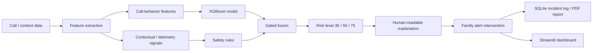

# Lumina

Digital-arrest scams trap victims in prolonged, pressured calls and cut them off from the people who could help. Lumina is an AI-powered safety bridge that identifies behavioral patterns associated with digital-arrest scams — unusually long calls, unknown callers, and isolation patterns — and surfaces a trusted-contact alert so family can intervene early. The victim never needs to recognize the scam or ask for help.

> **Illuminating the Digital Arrest Trap**

---

## Problem

Digital-arrest scams impersonate police, CBI, or government officials. Victims are forced to stay on long video calls while being threatened with arrest. During these attacks:

- Victims can be kept on prolonged calls for hours.
- Phones are monitored continuously and the victim is told not to contact anyone.
- Fear overrides rational decision-making; many lose life savings before realizing it is a scam.

Traditional cybercrime reporting tools only help **after** the fraud has happened. The core challenge is that victims are psychologically unable to seek help while the scam is ongoing — which is why an external, silent safety layer is needed.

---

## Solution

Lumina detects an ongoing digital-arrest pattern rather than a single suspicious message or call. The detection pipeline:

```
call / context data → feature extraction → XGBoost + safety rules
→ gated fusion → risk level → explanation → intervention
```

Multiple behavioral indicators (long call, unknown caller, video call, reduced outgoing activity) feed the ML model, while contextual/telemetry signals are handled separately by the safety-rule layer. The results are scored and explained in plain language. On HIGH/CRITICAL risk, a family alert is built — simulated by default, with optional real Twilio delivery (see [Intervention](#intervention)).

---

## Architecture



Key components:

- `app/core/features.py` — canonical feature schema and extraction.
- `app/core/risk_engine.py` — fused ML + rule scoring.
- `app/api/` — FastAPI routes (scoring, isolation detection, reports, alerts).
- `dashboard/app.py` — Streamlit frontend.

---

## Detection Engine

- **Model**: XGBoost (`XGBClassifier`), supervised binary classification, trained on **15,000 synthetic call snapshots**.
- **ML features**: 11 call-behavior features (duration, unknown caller, video call, hour of day, call history, outgoing activity, weekend, and derived log/early/late/activity features).
- **Telemetry excluded from ML**: device/isolation telemetry (`screen_time_on_call_percent`, app switches, SMS/social activity, etc.) is intentionally excluded from ML inference. Isolation signals are handled by the explicit safety-rule layer instead, so ML only corroborates call-behavior evidence.
- **Fusion**: `risk_score = 0.5 · ML_probability + 0.5 · safety_rules`.
- **Escalation gating**: ML is corroborative only — if rule evidence is below HIGH (50), the fused score is capped below HIGH; below CRITICAL (75), it is capped below CRITICAL. A high ML probability alone can never manufacture HIGH or CRITICAL risk. When ML is unavailable, scoring falls back to safety rules alone.
- **Risk thresholds**: `≥75` CRITICAL · `≥50` HIGH · `≥30` MEDIUM · else LOW.

---

## Intervention

- **Demo mode (default)**: a family alert is built and marked `SIMULATED` / `delivered: false`. No SMS is sent on a fresh installation.
- **Real Twilio (optional)**: requires the `twilio` dependency, `LUMINA_ALERT_MODE=real`, valid Twilio credentials, and `LUMINA_TRUSTED_CONTACTS`. Not active by default.
- **No automatic escalation**: there is no automatic police, government, or NGO integration. Support endpoints (`/api/ngos`, `/api/government-tools`, etc.) return static demo data only.

---

## Dashboard

A Streamlit dashboard (`dashboard/app.py`) that sends call/telemetry snapshots to the live backend and renders whatever the engine returns:

- Risk header with score and level.
- Explanation of why a risk was detected.
- Scripted digital-arrest / normal-call scenario runner.
- Incident history and PDF-report download.

The isolation score shown is produced by the canonical risk engine — not a canned number.

---

## Privacy & Security

What is implemented:

- **Telemetry/ML separation** — telemetry never reaches ML inference; only call-behavior features feed the model.
- **Download protection** — report-download endpoints validate and sanitize requested filenames against path traversal.
- **Alert abuse controls** — cooldown, rate-limit, and duplicate-suppression guards on alert delivery.
- **Consent-based design** — trusted contacts configured via `LUMINA_TRUSTED_CONTACTS`; no continuous call recording; explainable decisions; human intervention rather than automated enforcement.

Honest note: incident metadata is stored in a **plain SQLite database** (`data/incidents.db`). There is no hashing or encryption of stored records, no automatic retention/deletion, and no production-grade authentication. These are future work before any real deployment.

---

## Validation

```bash
python -m pytest tests/ -v
```

**140 tests — 140 passed.** Coverage includes the fused risk engine (escalation gating, false-positive guards, missing-telemetry safety), model-artifact loading failure behavior, alert abuse protection, silent-intervention gating, and API endpoint integration.

The ML benchmark (`models/saved/metrics.json`) is measured on data drawn from the same synthetic generator used at training time — it reflects internal consistency, not real-world performance. Real-world detection against live digital-arrest calls has **not** been measured.

---

## Project Status

**Implemented**
- Fused behavioral risk engine (XGBoost + safety rules)
- Call scoring and isolation-detection APIs
- Explainable risk output (`top_factors`)
- SQLite incident history and PDF report generation
- Silent-intervention alert builder
- Rule-based text scam scanner
- Streamlit dashboard and scenario runner
- 140 passing tests

**Simulated**
- SMS alert delivery (demo mode only; Twilio optional)
- Device telemetry (Android simulator)
- Support resources (NGOs, government tools, community alerts) — static demo data

**Future**
- Android on-device capture (`CallReceiver` / `LuminaService`)
- Real Twilio / WhatsApp delivery
- NLP transformer transcript classifier
- Live telecom / call-metadata integration

---

## Limitations

- The model is trained on **synthetic** data; real-world detection performance is unmeasured.
- SMS alerts are **simulated by default**; real delivery requires dependency, configuration, credentials, and trusted contacts.
- No live telecom or call-metadata integration; Android on-device capture is a skeleton.
- The text scanner is rule-based, not an NLP model.
- Incident storage is plain SQLite without retention guarantees.
- No production authentication or automated external escalation.

---

## Installation & Usage

```bash
git clone https://github.com/thanushreea1306/lumina.git
cd lumina
python -m venv venv
venv\Scripts\activate            # Windows
pip install -r requirements.txt
```

```bash
python run.py                    # backend on :8000
streamlit run dashboard/app.py   # dashboard on :8501
python -m app.services.android_simulator   # telemetry demo
```

| Interface | URL |
|---|---|
| Backend API | http://localhost:8000 |
| Swagger UI | http://localhost:8000/docs |
| Dashboard | http://localhost:8501 |

---

## Project Structure

```
app/
├── api/            # FastAPI routes
├── core/           # feature extraction, risk engine
├── services/       # alerts, reports, support integrations
dashboard/
└── app.py          # Streamlit dashboard
models/saved/       # XGBoost artifact + benchmark metrics
tests/              # 140 tests
run.py              # backend entrypoint
requirements.txt
```

---

## Roadmap

- Android on-device sensing wired to the API
- Real Twilio / WhatsApp alert delivery
- NLP transformer transcript classifier
- Privacy hardening: hashing, retention policy, on-device processing
- Live telecom call-metadata integration
- Real-time streaming analysis of an ongoing call

---

## License

MIT License — see `LICENSE`.
